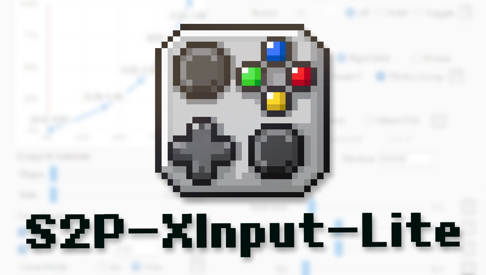
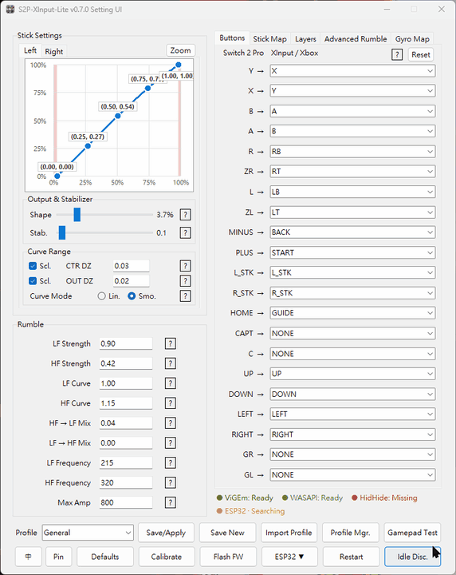
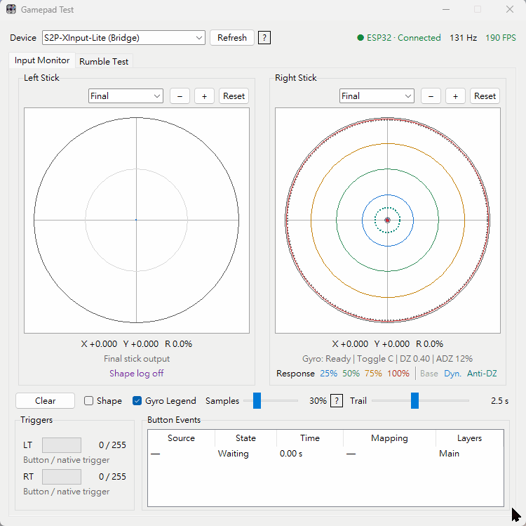

# S2P-XInput-Lite

[English](README.md) · [使用手冊](manual/USER_GUIDE_zh-TW.md) · [English Guide](manual/USER_GUIDE.md)

  
  

S2P-XInput-Lite 可在 Windows 為 Switch 2 Pro Controller 提供 XInput 相容控制器輸出，支援 USB 有線、ESP32-S3 USB 橋接器及 Windows 原生 BLE。

目前版本：**v0.7.7**

[v0.7.7 發佈說明](RELEASE_NOTES_v0.7.7.md) ·
[原始碼](https://github.com/duoduo-88/S2P-XInput-Lite/tree/main) ·
[最新正式版本](https://github.com/duoduo-88/S2P-XInput-Lite/releases/latest)

程式可在啟動時檢查新版本，也可在手把測試程式的「關於」頁手動檢查、
開關自動檢查，或選擇不再提醒特定版本。更新通知只會開啟官方 GitHub
Release 頁面供手動下載；程式不會自動下載、執行或覆蓋任何檔案。

> 本專案是獨立、非官方的社群作品，未獲 Nintendo、Microsoft、Espressif Systems、Apple 或 Google 授權、認證、贊助或背書，亦與這些公司無關。
>
> Nintendo Switch 為 Nintendo 的商標；Windows 與 Xbox 為 Microsoft 的商標；ESP32 為 Espressif Systems 的商標；Apple、macOS、iOS 與 iPadOS 為 Apple Inc. 的商標；Android 為 Google LLC 的商標。其他商標均屬其各自權利人所有。

### 行動裝置相容性

經實機測試，ESP32-S3 的 USB HID 獨立模式目前不相容於 macOS、iOS 或 iPadOS。

行動裝置目前僅支援具備 USB OTG 功能，且可正確辨識此 HID 手把模式的 Android 裝置。由於 Android 裝置型號、系統版本與遊戲的 USB HID 支援差異很大，無法保證所有裝置插入後都可直接使用。

行動裝置模式目前僅支援手把輸入，暫不支援遊戲震動回傳。Apple 裝置相容性與行動平台震動支援，將作為後續開發方向。

## 主要功能

- 自動依序使用 USB 有線、ESP32-S3 或原生 BLE，並即時顯示 6 軸／9 軸感測狀態
- 透過 ViGEmBus 輸出 XInput 相容虛擬控制器
- 低延遲輸入處理：保留按鍵邊緣事件，同時使用最新的搖桿與動作感測報告
- 按鍵、鍵盤、滑鼠、搖桿方向、線性扳機及線性滾輪映射，並共用一致的目標驗證
- 全域 Mapping Layer 檔案：支援按住／切換啟用、個別按鍵與搖桿覆寫、匯入／匯出，以及各設定檔獨立保存啟用狀態與順序
- 每支控制器獨立的搖桿校正，以及每次連線時的陀螺儀零偏初始化
- 搖桿曲線、死區、平滑、穩定化與輸出形狀調整
- USB、ESP32 與原生 BLE 共用一致的 XInput 至 HD Rumble 2 轉換，包含 latest-only 節流、優先停止訊框及音訊震動
- 可將相容設定檔寫入 ESP32，讓它不開啟 Windows 程式也能提供 PC XInput
  相容輸出或標準手機 USB HID
- 將陀螺儀映射至 XInput 搖桿或滑鼠
- 可單獨啟動的手把測試工具，主要針對由 S2P-XInput-Lite 連線及輸出的
  Switch 2 Pro Controller，可顯示完整的實體／處理後輸入、映射、感測器、
  連線與 ESP32 診斷資訊。亦可測試其他 XInput、WinMM 及 Raw HID 手把，
  但這些裝置不會提供 S2P 專屬遙測，因此部分資訊會缺少；回報率頁面仍可
  顯示回報筆數、P50／P95／P99、間隔統計與時間軸
- 內建 ESP32 診斷頁：支援定時測試、通過／警告／失敗判定及匯出文字報告
- 關於頁：提供專案與贊助連結、軟體許可協議及第三方程式聲明
- 完整遊戲設定檔，可一起切換搖桿、陀螺儀、震動、音訊觸覺與映射設定
- 繁體中文與英文介面
- 即時顯示連線、電量、ESP32、ViGEmBus、WASAPI 及 HidHide 狀態
- 依完整實測放電曲線估算電量百分比，並在介面及控制器玩家燈共用四級電量顯示

應用程式內各設定旁的 `?` 按鈕提供詳細說明。

## 系統需求

- Windows 10 或 11
- Switch 2 Pro Controller
- ViGEmBus 1.22.0
- USB 有線模式可選用最新版 [HidHide](https://github.com/nefarius/HidHide/releases/latest)，避免遊戲偵測實體 HID
- USB-C 資料線、Bluetooth，或相容的 ESP32-S3 N16R8 橋接器

發佈包已包含可攜式 Python 執行環境及所需套件，不必另外安裝 Python。

## 安裝與使用

1. 若尚未安裝 ViGEmBus，執行 `driver\Install-ViGEmBus.bat`。
2. USB 有線模式若希望遊戲只看到虛擬 XInput 控制器，可另外安裝 HidHide；ESP32 與原生 BLE 不需要 HidHide。
3. 請先連接控制器，再開啟 Steam 或其他控制器工具。原生 BLE 模式請勿在 Windows 藍牙設定內手動配對；只需開啟藍牙，讓本程式建立連線。ESP32 模式則接上已燒錄相容韌體的裝置。
4. 執行 `S2P-XInput-Lite.exe`。
5. 選擇遊戲設定檔或調整設定，再使用 **儲存設定檔** 或 **另存新設定檔**。
6. 儲存目前設定檔會更新其保存內容。連線中切換設定檔時，程式會自動停止連線、套用選定設定檔、刷新 GUI，並自動重新連線。只有變更連線方式、裝置或序列埠設定時才需要 **重新啟動**。

程式會先檢查 USB 有線，再檢查 ESP32，最後使用 Windows 原生 BLE。連線程序會開啟獨立黑色 CMD 視窗，即時顯示連線與輸入狀態；遊玩期間請保持該 CMD 視窗開啟。縮小設定介面時，只有主視窗會收進 Windows 右下角通知區，黑色 CMD 仍會顯示且連線不中斷。按一下通知區圖示可還原設定介面；按右鍵則可選擇「顯示設定」或「結束程式」。

設定介面與手把測試程式皆採全域單例。重複執行 `S2P-XInput-Lite.exe`、`GamepadTester.exe`，或重複按下「手把測試」，只會還原並帶出既有視窗，不會建立第二份程序。

第一次使用原生 BLE 配對時，啟動連線後按住控制器的 **SYNC** 鍵。已配對的控制器通常按任意鍵即可喚醒。

若未安裝 HidHide，程式會詢問是否開啟官方下載頁；選擇略過後不會在每次啟動時重複提醒，也不會阻止連線。需要時可點擊視窗下方的 **HidHide：缺少** 狀態開啟下載頁。USB 控制器已連接且 HidHide 尚未設定時，程式會先詢問，再將可攜式 `runtime\python.exe`、`src\raw_hid_probe.exe` 與選定的 Nintendo HID 加入 HidHide；若選擇暫不設定，之後也不會重複提醒，可點擊 **HidHide：關閉／設定** 重新叫出設定確認。其他應用程式既有的 HidHide 項目會保留。**恢復預設值** 只會移除本程式管理的兩個應用程式與選定控制器項目，並保留無關項目。

## 設定檔與 Mapping Layers

設定及每支控制器的搖桿校正資料儲存在 `src/config.ini`。陀螺儀零偏會在每次控制器連線後重新初始化，不會保存為永久校正資料。檔案不存在時，程式會以 `src/profiles/System Default.ini` 建立；舊設定缺少的欄位會自動補齊，不會覆寫既有值。各項預設值及還原操作也會以 `System Default.ini` 為基準。每個發佈包都必須保留此檔案，乾淨發佈包則可省略 `config.ini`。

首次啟動提供 General、Audio、FPS-COMP、FPS-IMM、Racing、Action 與 Rhythm 設定檔。選擇設定檔會更新介面；若連線程式正在執行，程式會自動停止並重新連線，使新設定檔完整載入。自訂設定檔可儲存、重新命名或刪除；**System Default** 是受保護的唯讀基準，固定顯示於清單最下方。**恢復預設值** 不會刪除設定檔或校正資料。

Mapping Layer 檔案是全域資源，可在按住按鍵組合時暫時覆寫目前設定檔，也可切換為持續啟用。Layer 可重新映射按鍵與搖桿方向、交換左右搖桿、用搖桿控制滑鼠，或輸出線性的 XInput 扳機、搖桿方向與滾輪。檔案儲存在 `src/layers`，並支援匯入與匯出。各遊戲設定檔會保存啟用哪些 Layers 及其優先順序；切換設定檔只會切換這些狀態，不會刪除或取代 Layer 檔案。同一時間只會套用優先權最高的符合 Layer：按住啟用優先於切換啟用，其餘依編輯器排列順序決定。

## 已驗證的低延遲路徑

- USB 有線輸入：250 Hz、4 ms 報告間隔；在同時進行震動壓力測試時未發生排隊或丟棄。
- ESP32 輸入：約 132 Hz；低延遲韌體將正常主機到達時間 p50／p95 從 7.986／8.059 ms 降至 7.500／7.595 ms。
- Windows 原生 BLE：66.7 Hz／15 ms，符合 WinRT `throughput_optimized` 的最低間隔。
- 所有傳輸皆採用 latest-only 震動。ESP32 與 USB 有線的遊戲變化及 zero 封包採用 7.5 ms 優先節流（實測約 8 ms），原生 BLE 為 15 ms；USB 音訊／Mix 更新採用 16.6 ms（約 60 Hz），一般刷新則為 15 ms。

## 注意事項與限制

- 僅支援 Windows，且一次只支援一支控制器。
- 不支援 Joy-Con 配對或 PS5 控制器模擬。
- ESP32 獨立模式不支援 Windows 鍵盤／滑鼠輸出、音訊震動、依程序自動
  切換設定檔、手機震動或 BLE HID 輸出。
- XInput 無法輸出原始動作感測資料，因此陀螺儀只能映射至搖桿或滑鼠。
- ESP32 連線需要相容韌體。寫入獨立模式設定檔、直接 USB 控制器輸出及
  診斷頁需要隨附的 `S2P-FW 1.0.2`；舊版 S2P 韌體與上游韌體無法提供完整
  的 `s2p_bridge 1.0.0` 功能。
- GitHub 原始碼庫包含完整 ESP32 原始碼；發佈包則只在 `esp32s3` 內提供
  燒錄工具及必要韌體映像。
- HidHide 不隨附，也不是 ESP32 或 BLE 的必要元件。未安裝時 USB 輸入仍可使用，但遊戲可能同時偵測實體 HID 與虛擬 XInput 控制器。
- 若 USB 狀態顯示 Basic 模式，請完整關閉 Steam 或其他控制器工具，重新連接控制器，再先啟動本程式。
- 搖桿校正請依 GUI 顯示的步驟操作。每次連線後請保持控制器靜止約 0.5 秒；收集至少 16 個穩定樣本後才會開始陀螺儀輸出，零偏取樣會繼續累積至 64 個樣本。
- 測試映射前請先儲存或套用變更；無效或損壞的映射資料會顯示錯誤，不會再靜默套用。
- 每個 HD Rumble 2 震動框依序封裝 9-bit LF 頻率、10-bit LF 振幅、9-bit HF 頻率與 10-bit HF 振幅。頻率數值範圍為 `0`～`511`，可近似以 Hz 理解；實際觸感仍會受致動器與外殼響應影響。
- 經過多款橋接實作及不同手把的實機測試，震動振幅越高，線性馬達在輸出快速變化時越可能出現輕微的機械撞擊聲；不過在一般使用情況下，影響通常不明顯。
- 設定中的 `0`～`1023` 是協議振幅欄位的可用範圍，不代表已公開認證的硬體安全連續輸出上限。本程式的系統預設最大振幅為 `500`，約為欄位上限的 49%，在保留清楚回饋的同時降低過強輸出造成異音的可能。建議依個別手把狀況及個人偏好調整；若出現撞擊聲或其他異音，請適度降低最大振幅。
- 將 LF 與 HF 振幅都設為零即可停止震動；所有傳輸的連線與 PIN 提示使用與 v0.5.1 相同的兩次短震動（LF `225`、HF `481`、振幅 `800`）。HF `481` 僅用於這個既有提示效果，不是一般遊戲震動的建議頻率。
- 刷寫前會讀取目前 ESP32 韌體版本並與內建的 `S2P-FW 1.0.2` 比對。刷寫成功後，程式會等待 USB 重新列舉，自動啟動桌面連接並重新搜尋手把。

## 上游專案與授權

本專案部分內容以 TommyWabg 的 [Switch2Connect](https://github.com/TommyWabg/Switch2Connect) 為基礎或由其衍生，並已為本專案修改與重整。

S2P-XInput-Lite 採用 [GNU General Public License v3.0](LICENSE)。第三方來源與
著作權聲明請參閱 [THIRD_PARTY_NOTICES.md](THIRD_PARTY_NOTICES.md)；發佈包所附的
完整授權文字、版本雜湊與對應源碼位置記錄在
[third_party/README.md](third_party/README.md)。

## 相容性與商標

文件中的產品名稱與商標僅用於辨識相容的硬體、軟體及介面。「XInput
相容」只表示可與接受 XInput 控制器輸入的軟體互通，不表示本專案或其
ESP32 韌體已獲 Microsoft 授權、認證、核准或製造。

ESP32 開發韌體使用非零售用途的開發 VID/PID，並未宣稱自己是 Microsoft
或 Xbox 零售控制器。此識別碼供開發與測試使用，並非正式分配的量產
識別碼，也可能與使用相同數值的其他開發裝置發生衝突。
