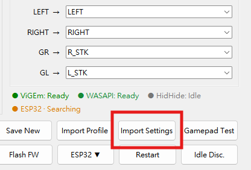

# S2P-XInput-Lite v0.7.11 Release Notes

## English

### Import Settings

- In the main window, **Manage Profiles** has been renamed to **Import Settings**.

- **Import Settings** transfers compatible data from another S2P-XInput-Lite
  installation, including older and same-version installations.
- Transferable data includes application settings, saved controller calibration
  and identity data, user Profiles, and managed Mapping Layers.
- The current version retains authority over the imported configuration. Keys
  introduced in the current version use their current defaults when absent from
  the source. The built-in **System Default** Profile is never imported or
  replaced.
- The import preview lists the detected data before any changes are applied. If
  a Profile or Layer has a matching name or ID, the operation requires a choice
  to overwrite all conflicts or skip all conflicts.
- Invalid or incompatible data aborts the operation without partially modifying
  `config.ini`, Profiles, or managed Layer files.

### Audio-Reactive Haptics

- The existing six-band vibration settings remain available and unchanged.
- Audio analysis compares short-term and long-term sound levels to identify
  transient events.
- Bass and high-frequency transients produce an increased response in the
  corresponding LF/HF vibration range. After the signal stabilizes, output
  returns to the baseline routing.
- Game rumble signals and transport intervals remain unchanged.

## 繁體中文

### 匯入設定

- 主視窗中的 **管理方案** 按鈕已更名為 **匯入設定**。

- **匯入設定**可從其他 S2P-XInput-Lite 安裝環境移轉相容資料，支援舊版及
  同版本安裝環境。
- 可移轉資料包括程式設定、已保存的手把校正與識別資料、使用者設定方案，以及
  程式管理的 Mapping Layer。
- 匯入後仍以目前版本的設定結構為準；來源資料缺少目前版本新增的項目時，會採用
  目前版本的預設值。內建的 **System Default** 方案不會被匯入或取代。
- 套用任何變更前，預覽會列出偵測到的資料。若設定方案或 Layer 的名稱或 ID 與
  現有項目相同，必須選擇全部覆蓋或全部略過。
- 若資料無效或不相容，匯入作業會中止，不會部分修改 `config.ini`、設定方案或
  程式管理的 Layer 檔案。

### 音訊震動反應

- 原有六頻段震動設定維持不變。
- 音訊分析會比較短期與長期音量特徵，以辨識瞬態事件。
- 低頻或高頻瞬態會在相應 LF/HF 頻段提高震動回饋；訊號穩定後，輸出會恢復至
  基準路由。
- 遊戲震動訊號及傳輸間隔維持不變。
