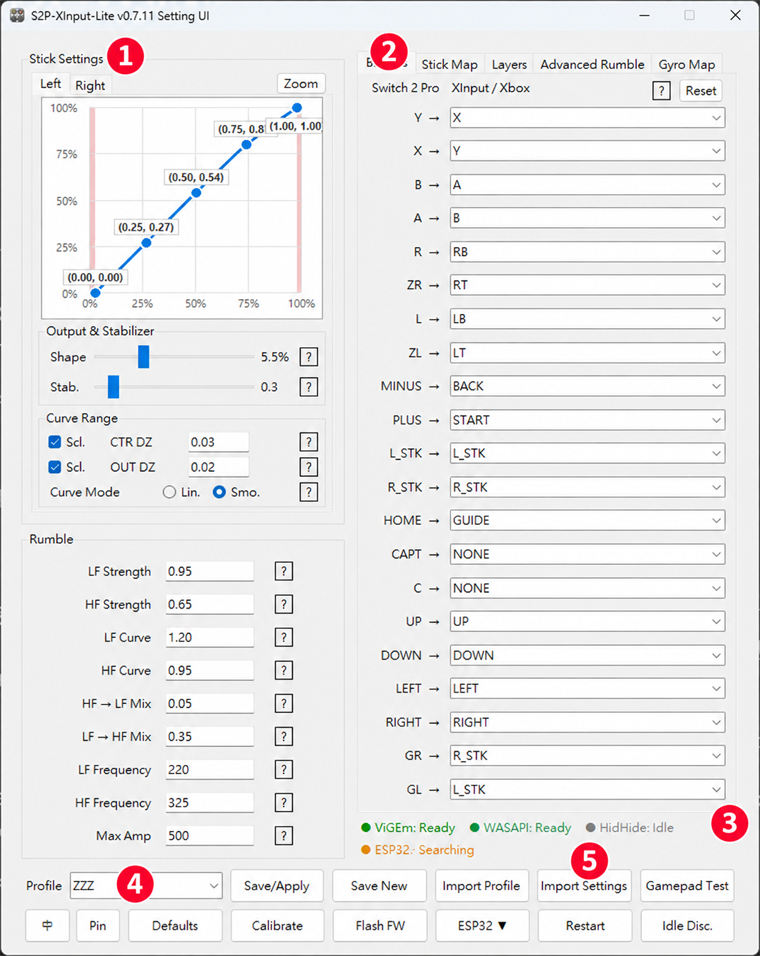
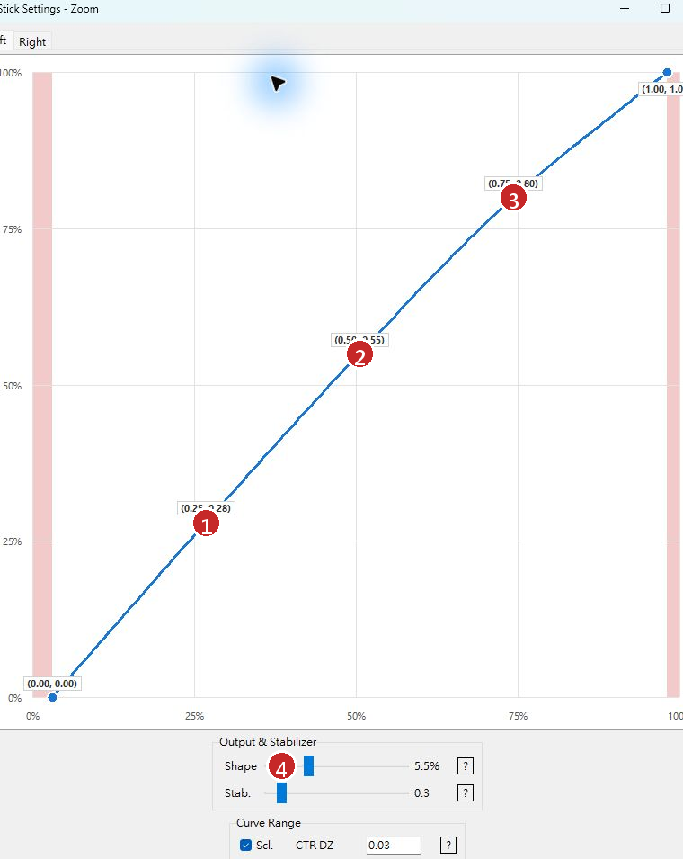
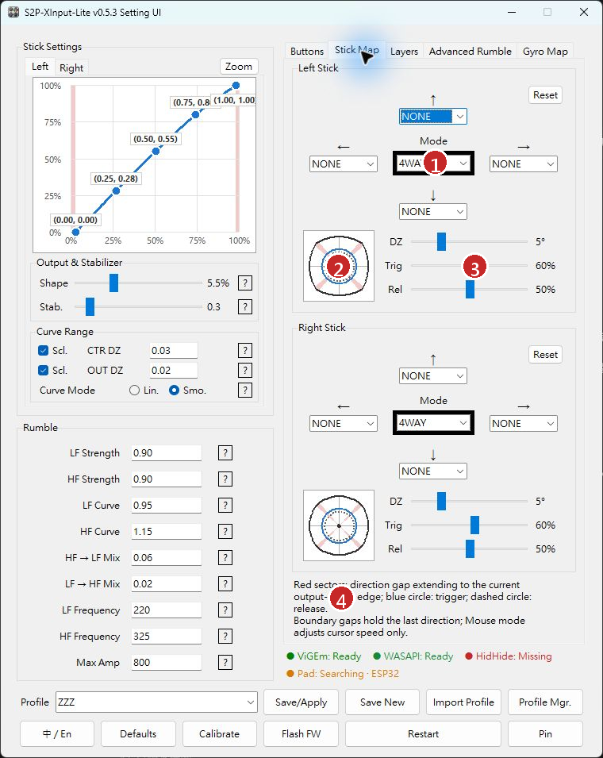
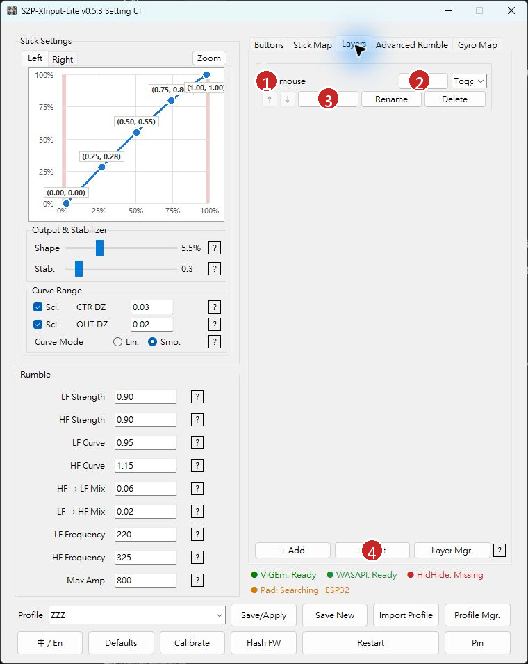
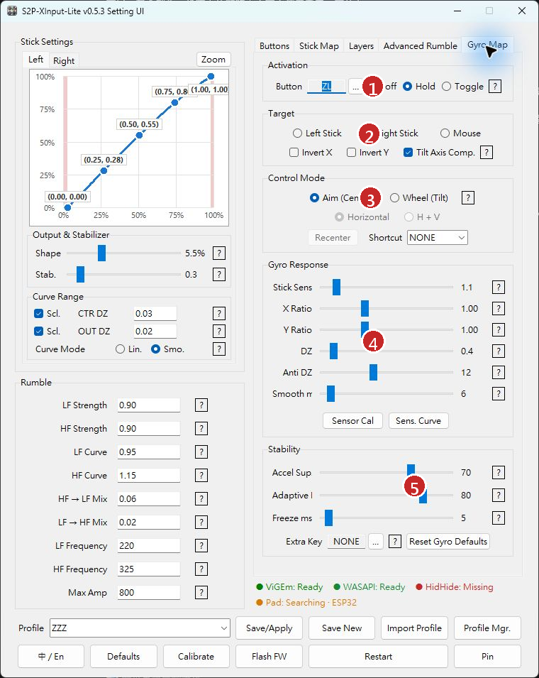
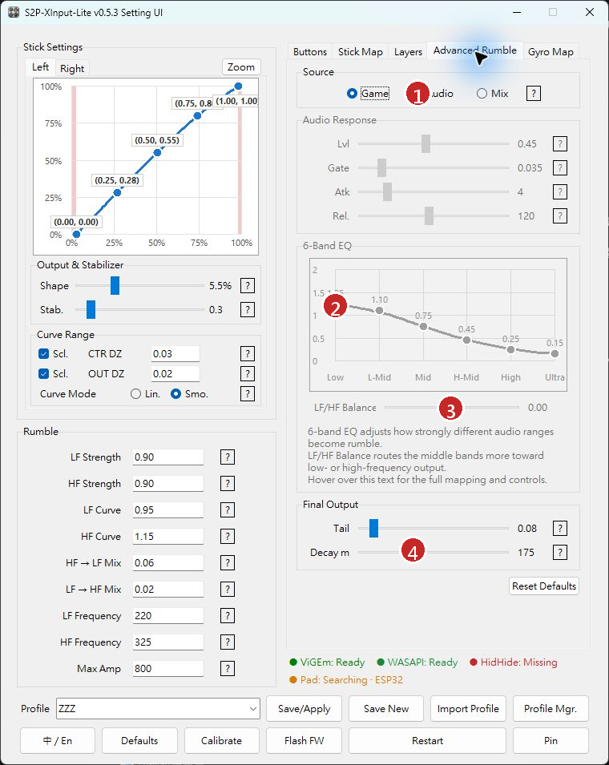
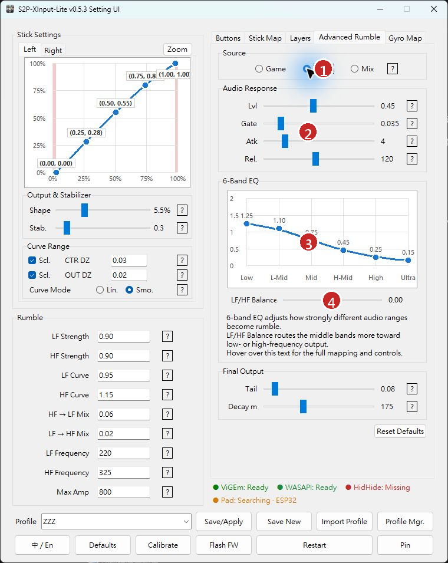

# S2P-XInput-Lite v0.5.3 User Guide

[繁體中文](USER_GUIDE_zh-TW.md)

This illustrated guide covers installation, connections, profiles, stick tuning, mapping, gyro controls, rumble, HidHide, and ESP32-S3 setup in S2P-XInput-Lite v0.5.3.

The screenshots use the English interface. Select **中 / En** in the lower-left corner of the main window to switch languages without changing the layout.

> [!IMPORTANT]
> After changing a value, select **Save/Apply** to write it to the current profile and apply it to the active connection. Switching profiles or closing the window does not save pending changes.

> [!TIP]
> Create a personal profile before experimenting. **System Default** is a read-only reference profile and cannot be overwritten.

## Contents

- [1. Getting started](#1-getting-started)
- [2. Main window and profiles](#2-main-window-and-profiles)
- [3. Stick settings](#3-stick-settings)
- [4. Button and direction mapping](#4-button-and-direction-mapping)
- [5. Mapping Layers](#5-mapping-layers)
- [6. Gyro mapping](#6-gyro-mapping)
- [7. Rumble settings](#7-rumble-settings)
- [8. HidHide and ESP32-S3](#8-hidhide-and-esp32-s3)
- [9. Quick controls](#9-quick-controls)
- [10. Troubleshooting](#10-troubleshooting)
- [Appendix: recommended tuning order](#appendix-recommended-tuning-order)

---

## 1. Getting started

### 1.1 Requirements

- Windows 10 or Windows 11.
- A Switch 2 Pro Controller and a data-capable USB-C cable.
- ViGEmBus 1.22.0 for creating the virtual Xbox 360 controller.
- HidHide is recommended for wired USB to prevent games from receiving both the physical HID device and the virtual Xbox controller.
- A compatible ESP32-S3 board is required for ESP32 bridge mode.

### 1.2 First launch

1. Extract the complete release archive into a new folder. Do not run the application from inside the archive.
2. Run `driver\Install-ViGEmBus.bat` when using the program for the first time.
3. Connect the controller or ESP32-S3.
4. Run `S2P-XInput-Lite.exe`.
5. Confirm that **ViGEm: Ready** appears in green at the bottom of the window.
6. Select a profile, adjust the settings, and select **Save/Apply**.

> [!NOTE]
> When updating from an older release, extract the new version into a separate folder. To preserve personal settings, copy the old `src/config.ini` into the new version while the application is closed.

### 1.3 Connection methods

#### Wired USB

Connect the controller directly to the PC with USB-C. This normally provides low latency and a stable update rate. HidHide is recommended.

#### ESP32-S3 bridge

The controller connects to the ESP32-S3 over BLE. The bridge then sends controller data to the PC over USB.

#### Windows BLE

Pair the controller directly with Windows. This is convenient, but update rate and stability can depend on the Bluetooth adapter and wireless environment.

---

## 2. Main window and profiles

1. **Stick curve** — Drag control points to change the input-to-output response. Left and Right configure the two sticks independently.
2. **Output and stabilizer** — Shape changes the response shape; Stab. suppresses small movements in amplified curve regions.
3. **Basic rumble** — LF/HF strength, curves, cross-mixing, frequencies, and maximum amplitude.
4. **Feature tabs** — Buttons, Stick Map, Layers, Advanced Rumble, and Gyro Map.
5. **Current tab** — The screenshot shows physical controller buttons mapped to Xbox outputs.
6. **Status row** — ViGEm, WASAPI, HidHide, controller, and ESP32 status.
7. **Profile tools** — Switch, save, create, import, or manage profiles.
8. **Global tools** — Language, defaults, calibration, firmware flashing, restart, and Pin.

### 2.1 Status indicators

- **ViGEm: Ready** — The virtual Xbox controller is available.
- **WASAPI: Ready** — System-output audio capture is available.
- **HidHide: Ready** — HidHide is installed and configured.
- **HidHide: Missing** — HidHide is not installed.
- **Pad: Searching** — No controller has been detected yet.
- **ESP32** — The ESP32-S3 bridge is active or being detected.

### 2.2 Profile controls

- **Profile** — Select a saved profile.
- **Save/Apply** — Save the current profile and apply it immediately.
- **Save New** — Create a new profile from the values currently shown.
- **Import Profile** — Import an external `.ini` profile.
- **Profile Mgr.** — Rename or delete personal profiles.

> [!WARNING]
> **System Default** is read-only. Use **Save New** to create an editable profile from it.

---

## 3. Stick settings

1. **25% point** — Controls response for small stick movement.
2. **50% point** — Controls the middle of the response.
3. **75% point** — Controls response near the outer range.
4. **Shape and Stab.** — Adjust response shape and slope-based stabilization.

### 3.1 Curve controls

- Drag a point to change the curve.
- The left stick is blue and the right stick is red.
- Double-click a point to restore its default.
- Right-click a point to enter exact X and Y coordinates.
- Select **Zoom** for the large curve editor.
- **Lin.** connects points linearly.
- **Smo.** uses a smooth curve.

### 3.2 Deadzones

- **CTR DZ** — Center deadzone used to remove drift near the neutral position.
- **OUT DZ** — Outer deadzone used to reach 100% before the stick reaches its physical limit.

Large deadzones shorten the usable stick range. Increase them only enough to solve center drift or insufficient outer travel.

### 3.3 Shape and Stab.

**Shape** adjusts the overall response character.

**Stab.** adds stabilization only where the curve slope is greater than 1:1:

- `0.0` — Off.
- `1.0` — Standard compensation.
- `2.0` — Stronger compensation.
- `3.0` — Maximum compensation.

Higher values are steadier but can feel smoother or less immediate.

### 3.4 Stick calibration

1. Select **Calibrate** at the bottom of the main window.
2. Follow the command-window instructions and leave the sticks centered when requested.
3. Slowly rotate each stick around its complete outer range.
4. Return to the settings window and test the result.

> [!TIP]
> Recommended order: calibration → center deadzone → outer deadzone → response curve → stabilizer.

---

## 4. Button and direction mapping

### 4.1 Buttons

The **Buttons** tab maps physical controller buttons to Xbox 360 outputs.

- The physical input is shown on the left.
- Select the Xbox output from the list on the right.
- `NONE` disables the output.
- **Reset** restores the mappings on this tab.
- Select **Save/Apply** to keep the changes.

The common layout swaps A/B and X/Y to match Xbox button positions. CAPT, C, GR, GL, and other extra buttons can also be assigned or disabled.

### 4.2 Stick Map

1. **Mode** — Select the direction mode, such as `4WAY`.
2. **Direction diagram** — Shows the active direction regions and boundary gaps.
3. **DZ / Trig / Rel** — Direction deadzone, trigger threshold, and release threshold.
4. **Independent sticks** — The left and right sticks can be configured and reset separately.

> [!TIP]
> Keep **Trig** above **Rel**. The resulting hysteresis prevents repeated activation when the stick rests on a direction boundary.

---

## 5. Mapping Layers

1. **Enable check box** — Enables or disables the layer.
2. **Activation** — Assigns the activation button and Toggle/Hold behavior.
3. **Layer actions** — Edit, Rename, and Delete.
4. **Layer tools** — Add, Import, and Layer Manager.

### 5.1 Creating a layer

1. Select **+ Add** and enter a recognizable name.
2. Select **Edit** and configure button, keyboard, or mouse mappings.
3. Assign the activation button.
4. Select **Hold** or **Toggle**.
5. Enable the check box beside the layer.
6. Select **Save/Apply**.

- **Hold** — Active only while the assigned button is held.
- **Toggle** — Each press alternates between enabled and disabled.

> [!WARNING]
> Layer edits remain in memory until **Save/Apply** succeeds. The layer files and profile state are not permanently saved before that point.

---

## 6. Gyro mapping

1. **Activation** — Assign an activation button and select Off, Hold, or Toggle.
2. **Target** — Left Stick, Right Stick, or Mouse.
3. **Control Mode** — Aim (Center) or Wheel (Tilt).
4. **Gyro Response** — Sensitivity, X/Y ratios, deadzone, anti-deadzone, and smoothing.
5. **Stability and calibration** — Stability controls, Sensor Cal, and sensitivity curve.

### 6.1 Activation and target

- **Off** — Gyro mapping is disabled.
- **Hold** — Gyro mapping is active while the assigned button is held.
- **Toggle** — Press once to enable and again to disable.
- **Left Stick / Right Stick** — Converts gyro motion into stick output.
- **Mouse** — Converts gyro motion into mouse movement.
- **Invert X / Y** — Reverses either axis.

### 6.2 Control modes

- **Aim (Center)** — Center-referenced aiming, normally used for shooters.
- **Wheel (Tilt)** — Output based on controller tilt, suitable for steering-style control.

### 6.3 Response settings

- **Stick Sens** — Gyro-to-stick sensitivity.
- **X Ratio / Y Ratio** — Horizontal and vertical scaling.
- **DZ** — Removes small center drift.
- **Anti DZ** — Raises the minimum output for small intentional movement.
- **Smooth ms** — Smoothing time. Higher values are steadier but feel less immediate.

### 6.4 Recommended setup

1. Place the controller on a stable surface and run **Sensor Cal**.
2. Select the target and activation behavior.
3. Start with low sensitivity.
4. Use X/Y Ratio to balance horizontal and vertical speed.
5. Add DZ only when the center drifts.
6. Add a small Anti DZ only when small motion does not register.
7. Adjust Smooth ms last.

> [!WARNING]
> During magnetometer calibration, move away from speakers, magnets, large metal objects, and powered equipment. Follow the prompt and rotate the controller through a complete three-dimensional figure-eight.

---

## 7. Rumble settings

### 7.1 Basic rumble

- **LF Strength / HF Strength** — Low- and high-frequency path strength.
- **LF Curve / HF Curve** — Response from small to large rumble commands.
- **HF → LF Mix / LF → HF Mix** — Cross-feed between the two paths.
- **LF Frequency / HF Frequency** — The two active frequency commands.
- **Max Amp** — Final amplitude limit.

### 7.2 Max Amp and mechanical noise

The amplitude field has a protocol range of `0–1023`. The default is `800`, approximately 78% of the field maximum, commonly described as about 80%.

Testing across multiple bridge implementations and controllers indicates that stronger output makes a linear actuator more likely to produce a light mechanical impact during rapid changes. The effect is usually minor during normal use.

The default of `800` is a practical balance between rumble strength and reducing excessive-output noise. It is not a certified continuous hardware safety limit.

> [!CAUTION]
> The `0–1023` field range does not mean every controller should run continuously at the maximum. Reduce Max Amp, LF/HF Strength, or the affected audio bands if you hear impacts, sharp buzzing, or unnatural vibration.

### 7.3 Game, Audio, and Mix

1. **Source** — Game, Audio, or Mix.
2. **Six-band curve** — Gain for each audio range.
3. **LF/HF Balance** — Routes the middle bands toward LF or HF.
4. **Final Output** — Tail and decay behavior.

- **Game** — Uses native game rumble only.
- **Audio** — Converts the Windows default output into rumble.
- **Mix** — Softly combines game and audio rumble without simple hard clipping.

### 7.4 Audio Response

1. **Audio source**
2. **Lvl / Gate / Atk / Rel**
3. **Low, L-Mid, Mid, H-Mid, High, and Ultra bands**
4. **LF/HF Balance**

- **Lvl** — Overall audio-to-rumble sensitivity.
- **Gate** — Rejects quiet background audio.
- **Atk** — Attack speed; lower values respond faster.
- **Rel** — Release time after the sound ends.

### 7.5 Six-band EQ

| Band | Range | Typical content |
|---|---:|---|
| Low | 20–120 Hz | Deep impacts and sub-bass |
| L-Mid | 120–300 Hz | Low-frequency body |
| Mid | 300–700 Hz | Low-mid detail |
| H-Mid | 700–2000 Hz | High-mid detail |
| High | 2000–4000 Hz | Friction and vocal edges |
| Ultra | 4000–8000 Hz | Sharp alerts and ultra-high detail |

- Drag a point to adjust its gain.
- Double-click a point to restore that band.
- `1.00` is neutral gain.
- These controls affect Audio and Mix, not Game-only rumble.

### 7.6 LF/HF Balance

- `-1.00` favors LF.
- `0.00` is balanced.
- `+1.00` favors HF.
- Start within `-0.15` to `+0.15`.

This control changes the routing of the middle bands; it does not change the six gain values.

### 7.7 High-frequency noise

If Audio or Mix produces continuous high-frequency noise:

1. Lower the High and Ultra bands.
2. Move LF/HF Balance slightly toward LF.
3. Raise Gate to reject quiet background audio.
4. Lower Lvl if every sound begins too strongly.
5. If needed, reduce HF Strength or Max Amp.

---

## 8. HidHide and ESP32-S3

### 8.1 HidHide

In wired mode, a game may see both the physical controller HID and the virtual Xbox controller, producing duplicate input. HidHide hides the physical HID while allowing S2P-XInput-Lite to keep reading it.

- **HidHide: Ready** — Installed and configured.
- **HidHide: Missing** — Not installed. Select the status text to open the download page.
- **HidHide: Off / Setup** — Installed but not configured.
- **HidHide: Error** — The configuration could not be read or changed.

If you dismiss an automatic reminder, it will not appear on every launch. Select the HidHide status at the bottom of the window to open the action again.

> [!WARNING]
> Close HidHide Configuration Client before retrying a failed setup. Enabling global cloaking can also affect other devices already present in the HidHide list.

### 8.2 Flashing ESP32-S3 firmware

1. Select **Flash FW**.
2. Connect the ESP32-S3 OTG port.
3. Hold **BOOT**.
4. Press **RESET / EN** once.
5. Release **RESET / EN**, then release **BOOT**.
6. The application detects the new COM port and flashes the firmware.
7. When complete, press **RESET / EN** or reconnect the board.
8. Restart S2P-XInput-Lite.

> [!CAUTION]
> Do not disconnect the ESP32-S3 or close the application while firmware is being written.

### 8.3 Pairing the controller

1. Connect the ESP32-S3 and start S2P-XInput-Lite.
2. Put the controller into pairing mode.
3. Hold **SYNC** when a new pairing is required.
4. The application detects the SYNC connection and writes the ESP32 pairing data.
5. Confirm that the Pad/ESP32 status changes to connected.

---

## 9. Quick controls

### 9.1 Sliders and values

- Select the displayed slider value to open the parameter-entry window.
- The window shows the valid range, step size, and help text.
- Hold a parameter label and drag right to increase or left to decrease.
- Each parameter follows its own discrete step sequence.

### 9.2 Right-click restore menu

- **Restore Last Saved Value** — Discards the unsaved change.
- **Restore System Default** — Uses the value from System Default.

### 9.3 Curve points

- Double-click to restore a point.
- Right-click to enter exact X and Y coordinates.
- Drag to adjust visually.

### 9.4 Six-band help

Hover over the six-band description to display a question-mark cursor and the complete guide for:

- Frequency ranges.
- Band-name mappings.
- LF/HF Balance.
- Drag and double-click controls.

### 9.5 Restart and Pin

- **Restart** — Restarts the connector and reloads the saved configuration.
- **Pin** — Makes the currently detected controller the preferred device. A successful action produces a notification rumble.

> [!WARNING]
> Select **Save/Apply** before Restart or pending changes may not be applied.

---

## 10. Troubleshooting

| Symptom | What to check |
|---|---|
| ViGEm is not Ready | Reinstall ViGEmBus, restart Windows, and launch the application again. |
| Duplicate game input | Configure HidHide and check whether Steam Input is also remapping the device. |
| Controller not found | Use a data-capable cable, reconnect the controller, or remove and repeat Windows BLE pairing. |
| ESP32 remains Searching | Check the OTG port, firmware, USB connection, and controller pairing state. |
| Audio rumble does not react | Confirm WASAPI is Ready, select Audio or Mix, and check the Windows default output device. |
| Quiet audio still vibrates | Raise Gate, lower Lvl, and reduce High/Ultra. |
| Mechanical impact noise | Lower Max Amp, LF/HF Strength, or the band that triggers the noise. |
| High-frequency noise in Audio/Mix | Lower High/Ultra, move Balance toward LF, raise Gate, and reduce HF Strength. |
| Gyro drift | Run Sensor Cal on a stable surface and avoid magnetic or powered objects. |
| Profile cannot be overwritten | System Default is read-only; use Save New. |
| Settings disappear after restart | Select Save/Apply and ensure the application folder is writable. |

### Restoring a stable configuration

1. Restore the suspicious parameter to its last saved value.
2. Compare the result with **System Default**.
3. Use **Defaults** only when a complete adjustable-settings reset is intended.
4. Select **Save/Apply**.
5. Select **Restart** and retest input and rumble.

> [!NOTE]
> A full reset retains stick calibration and saved profiles, but disables Mapping Layers and removes this application's HidHide entries.

---

## Appendix: recommended tuning order

### Sticks

Calibration → center deadzone → outer deadzone → curve → stabilizer.

### Gyro

Calibration → target → activation → sensitivity → X/Y ratios → deadzone → smoothing.

### Game rumble

Start with Game mode and Max Amp `800`. Reduce Max Amp or LF/HF Strength if the controller produces mechanical noise.

### Audio rumble

Gate → Lvl → six bands → LF/HF Balance → Tail/Decay.

### Profiles

Keep one verified stable profile and use **Save New** for experimental settings.

> [!NOTE]
> This guide applies to S2P-XInput-Lite v0.5.3. If a later release changes labels, ranges, or connection behavior, follow the in-app question-mark help and the current release notes.
