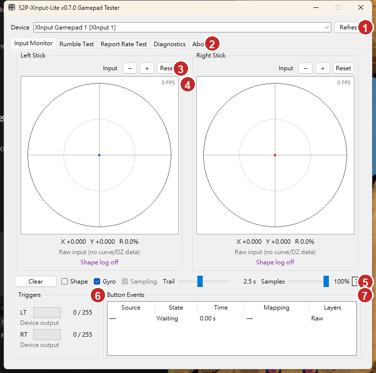
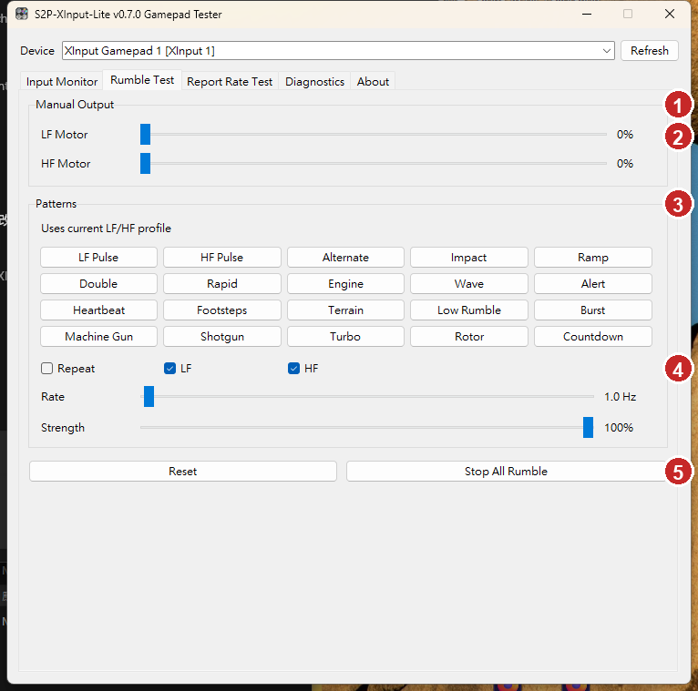
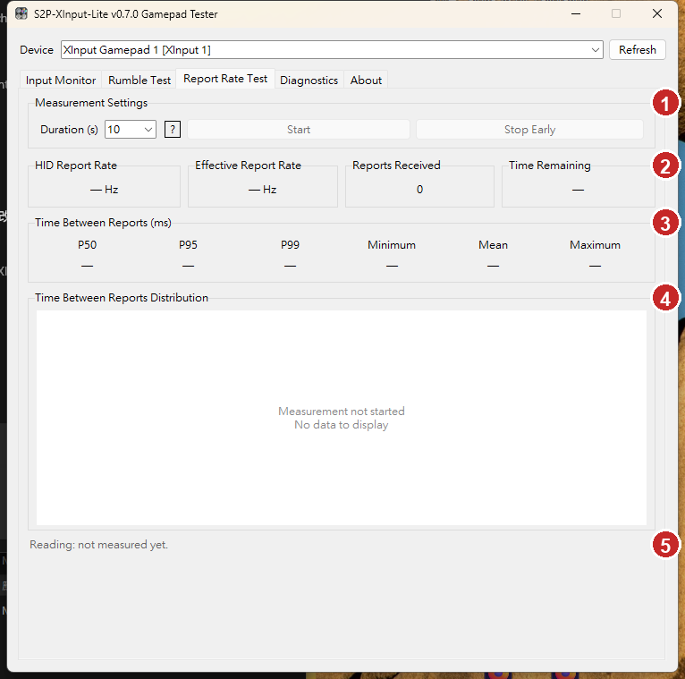
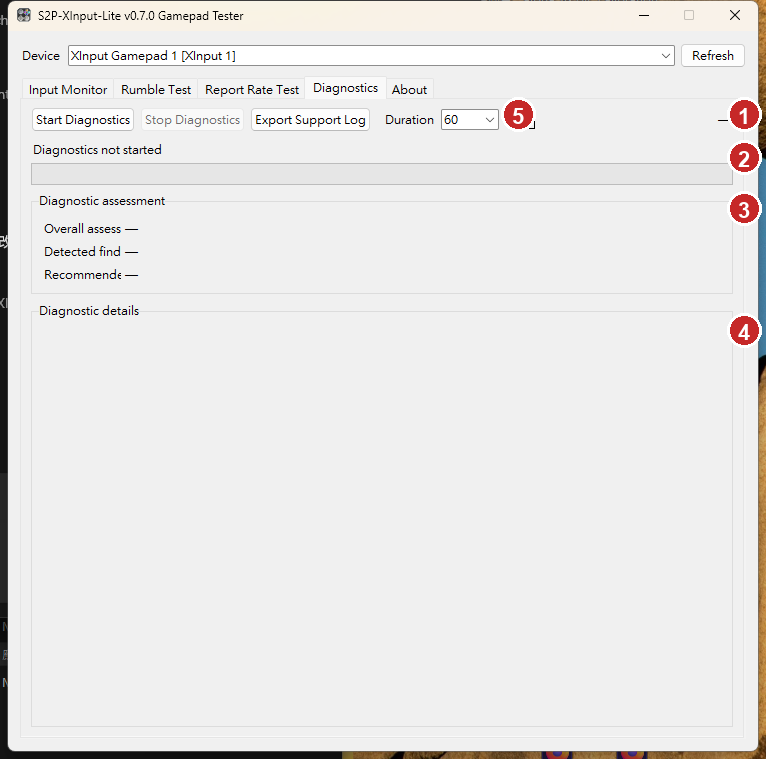
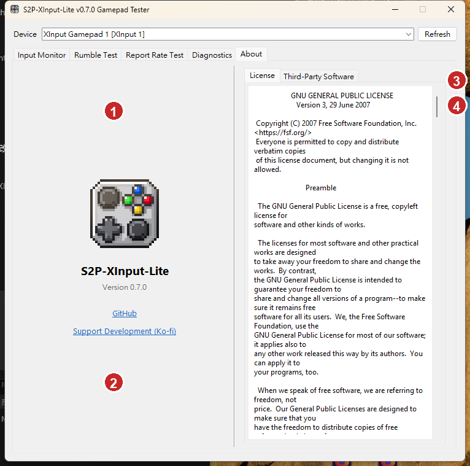
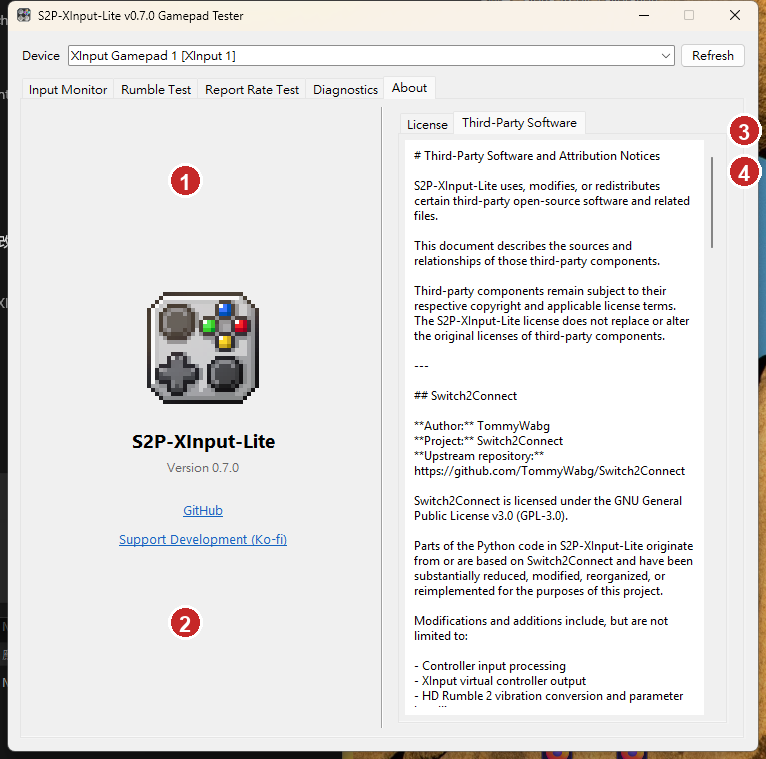

# S2P-XInput-Lite v0.7.7 使用手冊

本手冊介紹 v0.7.7 的安裝、連線、方案、搖桿、按鍵映射、陀螺儀、震動、
HidHide、ESP32-S3 橋接／獨立模式，以及手把測試、回報率、診斷與關於頁。

截圖採英文介面；按主視窗左下角的「中 / En」即可切換語言，功能位置不變。

> [!IMPORTANT]
> 修改數值後，必須按「儲存/套用（Save/Apply）」才會寫入目前方案並套用至連線。只切換方案或關閉視窗，不代表已經儲存。

> [!TIP]
> 建議先建立自己的方案，再逐項調整。`System Default` 是唯讀基準，無法直接覆寫。

## 目錄

- [1. 開始使用](#1-開始使用)
- [2. 主介面與方案](#2-主介面與方案)
- [3. 搖桿設定](#3-搖桿設定)
- [4. 按鍵與方向映射](#4-按鍵與方向映射)
- [5. Mapping Layers](#5-mapping-layers)
- [6. 陀螺儀映射](#6-陀螺儀映射)
- [7. 震動設定](#7-震動設定)
- [8. HidHide 與 ESP32-S3](#8-hidhide-與-esp32-s3)
- [9. 手把測試](#9-手把測試)
- [10. 快速操作技巧](#10-快速操作技巧)
- [11. 疑難排解](#11-疑難排解)
- [附錄：建議調整順序](#附錄建議調整順序)

---

## 1. 開始使用

### 1.1 系統需求

- Windows 10 或 Windows 11。
- Switch 2 Pro Controller 與可傳輸資料的 USB-C 線材。
- ViGEmBus 1.22.0，用來建立 XInput 相容虛擬控制器。
- USB 有線模式建議安裝 HidHide，避免遊戲同時收到實體 HID 與虛擬 XInput 輸入。
- ESP32 模式需要相容的 ESP32-S3 裝置。

### 1.2 第一次啟動

1. 將發佈壓縮檔完整解壓到新的資料夾，不要直接在壓縮檔內執行。
2. 第一次使用時，執行 `driver\Install-ViGEmBus.bat` 安裝 ViGEmBus。
3. 連接控制器或 ESP32-S3。
4. 執行 `S2P-XInput-Lite.exe`。
5. 確認視窗底部的 ViGEm 顯示綠色 `Ready`。
6. 選擇方案並完成設定後，按「儲存/套用」。

連線程序會另外開啟黑色 CMD 視窗，即時顯示配對、連線、輸入與傳輸狀態。遊玩期間請保持 CMD 視窗開啟；關閉 CMD 會中止目前連線。縮小設定介面時，只有主視窗會移到 Windows 右下角通知區，黑色 CMD 仍會顯示且連線不中斷。按一下通知區圖示可還原設定介面；按右鍵則可選擇「顯示設定」或「結束程式」。

設定介面與手把測試程式各自只允許一份。重複啟動時會還原並帶出原有視窗，不會再建立另一份程序或搶占控制器。

> [!NOTE]
> 從舊版更新時，請解壓到新資料夾。若要保留個人設定，可在程式關閉時將舊版 `src/config.ini` 複製到新版。

### 1.3 連線方式

#### USB 有線

控制器直接以 USB-C 連接電腦。延遲低且更新率穩定，建議搭配 HidHide。

#### ESP32-S3

控制器以 BLE 連接 ESP32-S3，再由 ESP32-S3 透過 USB 將資料傳給電腦。

v0.7.7 提供兩種不需要持續開啟 Windows 程式的獨立輸出：

- **PC XInput 獨立模式**：ESP32 直接向 Windows 提供 XInput 相容輸出。
- **手機 USB HID 模式**：ESP32 以標準 USB HID Gamepad 連接手機或其他相容主機。

控制器四顆玩家燈會累進顯示實測電量：低電量亮一顆、中低亮兩顆、中高亮三顆、
高電量亮四顆。隨附的 S2P-FW 1.0.2 在獨立模式也能顯示，不需要持續開啟
Windows 程式。

#### Windows BLE

控制器直接與 Windows 藍牙配對。使用方便，但更新率與穩定度可能受到藍牙硬體及無線環境影響。

---

## 2. 主介面與方案

1. **搖桿曲線**：拖曳控制點，調整輸入與輸出的對應。`Left` 與 `Right` 分別設定左右搖桿。
2. **輸出與防抖**：`Shape` 調整輸出形狀；`Stab.` 抑制曲線放大區域的小幅抖動。
3. **基本震動**：設定 LF/HF 強度、曲線、混合、頻率與最大振幅。
4. **功能頁籤**：Buttons、Stick Map、Layers、Advanced Rumble、Gyro Map。
5. **目前頁面內容**：圖中為實體按鍵對應 Xbox 按鍵。
6. **狀態列**：顯示 ViGEm、WASAPI、HidHide 與控制器／ESP32 狀態。
7. **方案工具**：切換、儲存、另存、匯入及管理方案。
8. **全域工具**：切換語言、還原、校正、刷入韌體、重啟連線與 Pin。

### 2.1 狀態列

- `ViGEm: Ready`：虛擬 XInput 控制器可用。
- `WASAPI: Ready`：系統音訊擷取可用。
- `HidHide: Ready`：HidHide 已安裝且設定完成。
- `HidHide: Missing`：尚未安裝 HidHide。
- `Pad: Searching`：尚未偵測到控制器。
- `ESP32`：目前使用或正在搜尋 ESP32-S3。

### 2.2 方案操作

- **切換方案**：從 `Profile` 下拉選單選擇已儲存方案。
- **儲存/套用（Save/Apply）**：儲存目前方案並立即套用。
- **另存新方案（Save New）**：使用目前畫面數值建立新方案。
- **匯入方案（Import Profile）**：匯入外部 `.ini` 方案。
- **管理方案（Profile Mgr.）**：重新命名或刪除個人方案。

> [!WARNING]
> `System Default` 為唯讀方案。需要修改時，請使用「另存新方案」。

---

## 3. 搖桿設定

1. **25% 控制點**：調整小幅推桿時的輸出反應。
2. **50% 控制點**：調整中段反應。
3. **75% 控制點**：調整接近外圈時的反應。
4. **Shape 與 Stab.**：控制曲線形狀與防抖補償。

### 3.1 曲線操作

- 拖曳藍色控制點可修改曲線。
- 左搖桿使用藍色，右搖桿使用紅色。
- 雙擊控制點可還原該點預設。
- 右鍵控制點可直接輸入 X、Y 座標。
- `Zoom` 可開啟大型曲線編輯視窗。
- `Lin.` 使用線性連接。
- `Smo.` 使用平滑曲線。

### 3.2 死區

- `CTR DZ`：中心死區，用來消除搖桿中心偏移。
- `OUT DZ`：外圈死區，讓搖桿尚未完全推到底時即可達到 100%。

死區過大會縮短有效行程。建議只增加到足以消除漂移或外圈不足的程度。

### 3.3 Shape 與 Stab.

#### Shape

調整搖桿輸出的整體形狀與反應感。數值越高，曲線形狀修正越明顯。

#### Stab.

在曲線斜率大於 1:1 的放大區域增加防抖：

- `0.0`：關閉。
- `1.0`：標準補償。
- `2.0`：加強補償。
- `3.0`：最強補償。

數值越高，輸出越穩定，但也可能產生較明顯的平滑感。

### 3.4 搖桿校正

1. 按主視窗下方「校正搖桿（Calibrate）」。
2. 依命令列提示讓搖桿回到中心。
3. 沿完整外圈緩慢旋轉搖桿。
4. 完成後回到主介面測試。

> [!TIP]
> 建議依序進行：校正 → 中心死區 → 外圈死區 → 曲線 → 防抖。

---

## 4. 按鍵與方向映射

### 4.1 Buttons

`Buttons` 頁面將控制器的實體按鍵映射為 Xbox 360 輸出。

- 左側為實體按鍵。
- 右側下拉選單為 Xbox 輸出。
- `NONE` 表示不輸出。
- `Reset` 會還原本頁映射。
- 修改後仍需按 `Save/Apply`。

一般方案可將 A/B 與 X/Y 對調，以符合 Xbox 的按鍵位置。CAPT、C、GR、GL 等額外按鍵也能指定為 Xbox 按鍵或 `NONE`。

### 4.2 Stick Map

1. **Mode**：選擇方向判定方式，例如 `4WAY`。
2. **方向圖**：紅色區域表示目前方向缺口或邊界。
3. **DZ／Trig／Rel**：設定死區、觸發門檻與釋放門檻。
4. **左右搖桿**：可分別設定，並分別還原。

#### 重要參數

- `DZ`：方向判定死區。
- `Trig`：進入方向區域後的觸發門檻。
- `Rel`：離開方向區域後的釋放門檻。

> [!TIP]
> `Trig` 應高於 `Rel`，形成遲滯區，避免搖桿停在方向邊界時快速重複觸發。

---

## 5. Mapping Layers

1. **啟用方塊**：勾選後啟用該映射層。
2. **啟動方式**：指定啟動按鍵及 `Toggle`／`Hold`。
3. **層操作**：Edit、Rename、Delete。
4. **層管理工具**：新增、匯入與管理映射層。

### 5.1 建立映射層

1. 按 `+ Add`。
2. 輸入容易辨識的名稱。
3. 按 `Edit` 設定按鍵、鍵盤或滑鼠映射。
4. 指定啟動按鍵。
5. 選擇 `Hold` 或 `Toggle`。
6. 勾選映射層左側方塊。
7. 按 `Save/Apply`。

### 5.2 Hold 與 Toggle

- `Hold`：按住指定按鍵時啟用，放開後停用。
- `Toggle`：每按一次切換啟用或停用。

> [!WARNING]
> Mapping Layer 的編輯會先保留在記憶體。只有 `Save/Apply` 成功後，層檔案與方案狀態才算正式保存。

---

## 6. 陀螺儀映射

1. **Activation**：指定啟用按鍵，並選擇 Off、Hold 或 Toggle。
2. **Target**：輸出至左搖桿、右搖桿或滑鼠。
3. **Control Mode**：Aim（Center）或 Wheel（Tilt）。
4. **Gyro Response**：感度、X/Y 比例、死區、反死區與平滑。
5. **Stability 與校正**：穩定性設定、Sensor Cal 及感度曲線。

### 6.1 Activation

- `Off`：關閉陀螺儀映射。
- `Hold`：按住指定按鍵時啟用。
- `Toggle`：按一下啟用，再按一下關閉。

### 6.2 Target

- `Left Stick`：陀螺儀輸出至左搖桿。
- `Right Stick`：陀螺儀輸出至右搖桿，常用於瞄準。
- `Mouse`：輸出為滑鼠移動。
- `Invert X / Y`：反轉水平或垂直方向。

### 6.3 Control Mode

- `Aim (Center)`：以中心為基準，適合射擊遊戲瞄準。
- `Wheel (Tilt)`：依控制器傾斜角度輸出，適合方向盤或傾斜控制。

### 6.4 Gyro Response

- `Stick Sens`：陀螺儀轉換為搖桿時的感度。
- `X Ratio / Y Ratio`：分別調整水平及垂直比例。
- `DZ`：消除中心小幅漂移。
- `Anti DZ`：提高小幅動作的最低輸出。
- `Smooth ms`：平滑時間。越高越穩定，但延遲感也越明顯。

### 6.5 建議設定順序

1. 將控制器放在穩定平面，執行 `Sensor Cal`。
2. 選擇 Target。
3. 選擇 Hold 或 Toggle。
4. 從較低感度開始測試。
5. 使用 X/Y Ratio 修正水平與垂直速度差。
6. 只有中心漂移時才增加 DZ。
7. 小動作無法輸出時，再少量增加 Anti DZ。
8. 最後調整 Smooth ms。

> [!WARNING]
> 進行磁力計校正時，請遠離喇叭、磁鐵、大型金屬物與通電設備，並依提示讓控制器完成多方向的 3D 八字翻轉。

---

## 7. 震動設定

### 7.1 基本震動

- `LF Strength`：低頻路徑強度。
- `HF Strength`：高頻路徑強度。
- `LF Curve / HF Curve`：調整小訊號到大訊號的反應曲線。
- `HF → LF Mix`：將部分高頻路徑混入低頻。
- `LF → HF Mix`：將部分低頻路徑混入高頻。
- `LF Frequency / HF Frequency`：設定兩個震動頻率命令。
- `Max Amp`：限制最終振幅。

### 7.2 Max Amp 與異音

震動振幅欄位範圍為 `0–1023`，預設值為 `500`，約為欄位上限的 49%。

經過多款橋接軟體及不同手把的實際測試，震動強度越高，線性馬達在震動快速變化時，越可能出現輕微的撞擊聲。不過在一般使用情況下影響並不明顯。

由於目前沒有明確的硬體安全輸出上限，本程式以 `500` 作為通用預設值，在保留清楚回饋的同時，降低過強輸出造成異音的可能。

> [!CAUTION]
> `0–1023` 是協議欄位範圍，不代表所有控制器都適合長時間使用最高值。若出現明顯撞擊聲、尖銳聲或不自然震感，請降低 Max Amp、LF/HF Strength 或相關頻段增益。

### 7.3 Game／Audio／Mix

1. **Source**：選擇 Game、Audio 或 Mix。
2. **六頻段曲線**：調整各音訊頻段的增益。
3. **LF/HF Balance**：控制中間頻段偏向低頻或高頻路徑。
4. **Final Output**：控制震動尾端與衰減。

#### Game

只使用遊戲原生震動。

#### Audio

將 Windows 預設輸出裝置的音訊轉換為震動。

#### Mix

柔和混合遊戲原生震動與音訊震動，避免直接硬性疊加造成飽和。

### 7.4 Audio Response

1. **Audio**：將 Windows 預設輸出裝置的聲音轉為震動。
2. **Lvl／Gate／Atk／Rel**：設定音訊震動反應。
3. **六頻段**：Low、L-Mid、Mid、H-Mid、High、Ultra。
4. **LF/HF Balance**：控制中間頻段路由。

#### Lvl

音訊轉震動的整體敏感度。

- 整體太弱：提高 Lvl。
- 聲音一開始就過強：降低 Lvl。

#### Gate

噪音門檻。

- 安靜處仍持續震動：提高 Gate。
- 只有非常大聲才有反應：降低 Gate。

#### Atk

起振速度。數值較小時反應較快。

#### Rel

聲音結束後的釋放時間。數值較高時，震動尾端延續較久。

### 7.5 六頻段

| 頻段 | 範圍 | 主要內容 |
|---|---:|---|
| Low | 20–120 Hz | 深沉撞擊與超低頻 |
| L-Mid | 120–300 Hz | 低頻厚度 |
| Mid | 300–700 Hz | 中低頻細節 |
| H-Mid | 700–2000 Hz | 中高頻細節 |
| High | 2000–4000 Hz | 摩擦與人聲邊緣 |
| Ultra | 4000–8000 Hz | 尖銳提示與超高頻細節 |

- 拖曳控制點可調整該頻段增益。
- 雙擊控制點可還原該頻段預設。
- `1.00` 為中性增益。
- 這些設定只影響 Audio 與 Mix，不影響純 Game 模式。

### 7.6 LF/HF Balance

- `-1.00`：中間頻段偏向 LF。
- `0.00`：平衡。
- `+1.00`：中間頻段偏向 HF。
- 建議先從 `-0.15～+0.15` 範圍測試。

LF/HF Balance 只改變中間頻段的路由，不會修改六個頻段本身的增益。

### 7.7 高頻噪音排查

若 Audio 或 Mix 模式出現持續高頻聲：

1. 降低 High 與 Ultra 增益。
2. 將 LF/HF Balance 稍微向 LF 移動。
3. 提高 Gate，過濾安靜背景聲。
4. 若所有聲音一開始就過強，降低 Lvl。
5. 若仍有異音，降低 HF Strength 或 Max Amp。

---

## 8. HidHide 與 ESP32-S3

### 8.1 HidHide

USB 有線模式下，遊戲可能同時看到：

- 實體控制器 HID。
- S2P-XInput-Lite 建立的虛擬 XInput 控制器。

這會造成按鍵或方向被讀取兩次。HidHide 可隱藏實體 HID，同時允許 S2P-XInput-Lite 繼續讀取。

#### 狀態說明

- `HidHide: Ready`：已安裝且設定完成。
- `HidHide: Missing`：尚未安裝。點擊狀態文字可開啟下載頁。
- `HidHide: Off / Setup`：已安裝但尚未完成隱藏設定。
- `HidHide: Error`：無法讀取或修改 HidHide 設定。

選擇不再提醒後，程式不會每次啟動重複詢問。需要時仍可點擊視窗底部的 HidHide 狀態。

> [!WARNING]
> HidHide 設定失敗時，請先關閉 HidHide Configuration Client，再回到 S2P-XInput-Lite 重試。若 HidHide 清單中已有其他裝置，啟用全域隱藏也可能影響那些裝置。

### 8.2 刷入 ESP32-S3 韌體

1. 按主視窗底部「刷入相容韌體（Flash FW）」。
2. 程式先讀取目前韌體版本，並與內建的 `S2P-FW 1.0.2` 比對。
3. 確認畫面會列出目前版本與內建版本；可選擇刷入或取消。若版本檢查曾暫停
   連接程式，取消後會自動恢復。
4. 確認刷入後，將 ESP32-S3 的 OTG 接口接到電腦並按住 `BOOT`。
5. 按一下 `RESET / EN`，先放開 `RESET / EN`，再放開 `BOOT`。
6. 程式會依 USB 身分辨識 ESP32-S3 ROM 刷機連接埠；即使該 COM 已存在也能
   使用，接著自動刷入韌體。
7. 刷寫成功後 ESP32 會切回橋接模式；USB 重新列舉完成後，桌面連接程式會
   自動啟動並重新搜尋手把。
8. 若數秒後橋接裝置仍未出現，請按一下 `RESET / EN` 或重新插拔 ESP32-S3。

> [!CAUTION]
> 刷寫期間不要拔除 ESP32-S3，也不要關閉程式。

### 8.3 控制器與 ESP32-S3 配對

1. 將 ESP32-S3 接到電腦並啟動 S2P-XInput-Lite。
2. 讓控制器進入配對模式。
3. 需要建立新配對時，按住控制器的 `SYNC`。
4. 程式偵測到 SYNC 配對連線後，會將 ESP32-S3 配對資料寫入控制器。
5. 確認底部 Pad／ESP32 狀態變為已連線。

### 8.4 ESP32 三種運作方式

| 模式 | 是否需要保持程式開啟 | 輸出端 | 主要用途 |
|---|---:|---|---|
| ESP32 橋接模式 | 是 | Windows 虛擬 XInput | 使用完整桌面功能 |
| PC XInput 獨立模式 | 否 | Windows XInput 相容 USB | 將設定存入 ESP32 後直接遊玩 |
| 手機 USB HID 模式 | 否 | 標準 USB HID Gamepad | 以 USB 連接 Android 或其他相容主機 |

獨立模式由 ESP32 執行相容的校正、搖桿曲線、死區、輸出形狀、按鍵映射、
Mapping Layers、陀螺儀轉搖桿及遊戲震動設定。它不會執行需要 Windows
環境的功能。

### 8.5 寫入設定並啟用獨立模式

1. 選擇要寫入的方案。
2. 完成參數調整後先按 **Save/Apply**。
3. 確認 ESP32 已連線且使用隨附的 `S2P-FW 1.0.2` 韌體。
4. 點擊底部 **ESP32 ▼**。
5. 選擇 **寫入並啟用 PC XInput 獨立模式**，或
   **寫入並啟用手機 USB HID 模式**。
6. 檢查相容性提示。若方案包含 Windows 專用輸出，請取消並修正，或確認
   略過不支援的項目。
7. 等待寫入、CRC 驗證及執行期套用完成。
8. ESP32 會自動重新啟動；若 USB 裝置沒有重新出現，請重新插拔。

若目前介面有尚未儲存的變更，程式會要求先儲存，不會偷偷寫入上次保存的
舊數值。`System Default` 是唯讀方案，修改後需先使用 **Save New**。

> [!NOTE]
> 寫入使用 A/B 儲存槽：目前有效設定保留在一個槽，新設定先寫入另一個槽，
> 通過長度、CRC 與參數驗證後才切換為有效設定。寫入中斷時，ESP32 會繼續
> 使用上一份有效設定；A/B 不是兩個需要使用者手動選擇的方案。

### 8.6 切回橋接模式

1. 將 ESP32 接回 Windows，開啟 S2P-XInput-Lite。
2. 點擊 **ESP32 ▼**。
3. 選擇 **切回 ESP32 橋接模式**。
4. 確認提示後，ESP32 會重新啟動並重新列舉 USB 裝置。
5. 桌面連接程式會自動啟動並重新搜尋手把；即使切換前沒有執行也會啟動。
6. 若數秒後仍未找到橋接裝置，請重新插拔 ESP32；**重新啟動連線**保留為
   手動備援。

**重新啟動連線**只會重啟目前桌面連線，不會覆寫 ESP32 中保存的設定。

### 8.7 獨立模式支援範圍

可寫入：

- 手把按鍵互相映射、左右搖桿交換及相容的 Mapping Layers。
- 搖桿校正、中心／外圈死區、曲線、輸出形狀、防抖與平滑。
- 線性扳機及相容的搖桿方向輸出。
- 陀螺儀轉左／右搖桿及其啟用、感度、死區與平滑設定。
- Game 模式震動、LF/HF 頻率、強度與最大振幅。

不能帶入：

- Windows 鍵盤、滑鼠、組合鍵或系統快捷鍵輸出。
- Audio／Mix 音訊震動。
- 依執行程序自動切換方案。
- 陀螺儀轉 Windows 滑鼠。
- 手機遊戲震動與 BLE HID 輸出。

手機是否接受 Home、Capture 或額外按鍵由手機系統與遊戲決定。手機 USB
HID 模式會同時提供類比扳機軸與數位 L2／R2，以提高遊戲相容性。
iPhone、iPad 或 macOS 應使用標準 USB HID 模式，而不是 PC XInput
獨立模式；是否能辨識、是否需要轉接器，以及遊戲是否支援仍取決於裝置、
作業系統與遊戲，目前不保證所有 Apple 裝置皆可使用。

---

## 9. 手把測試

1. **裝置與重新整理**：選擇要檢查的控制器，或重新掃描裝置。
2. **功能分頁**：切換輸入監看、震動測試、回報率、診斷及關於頁。
3. **搖桿來源與縮放**：左右搖桿可分別選擇資料來源及調整視圖。
4. **左右搖桿圖**：即時呈現位置、軌跡、輸出形狀與輔助線。
5. **取樣與軌跡控制**：調整取樣比例、軌跡時間及顯示項目。
6. **扳機輸入**：分別顯示 LT、RT 的目前數值及輸入類型。
7. **按鍵事件**：列出按鍵狀態、持續時間、實際映射與作用中的圖層。

按主視窗底部的 **手把測試** 開啟獨立測試程式。測試程式與設定視窗分開
執行，因此高更新率繪圖不會拖慢設定操作。再次按下按鈕會將既有測試視窗
叫到最上層，不會重複開啟。也可直接啟動獨立的手把測試應用，不必先開啟
設定視窗。

> [!IMPORTANT]
> 手把測試主要針對由 S2P-XInput-Lite 本身連線及處理的 Switch 2 Pro
> Controller。其他 XInput、WinMM 或 Raw HID 手把也能進行基本輸入、震動及
> 回報率測試，但不會提供 S2P 的共享遙測；實體／處理後來源、有效映射、
> Mapping Layer、電量、感測器、傳輸狀態與 ESP32 診斷等資訊可能缺少，
> 這是預期行為。

### 9.1 選擇測試來源

- **S2P-XInput-Lite**：測試目前程式輸出的 XInput 控制器，並顯示套用前、
  套用後及合成結果。
- **其他控制器**：可選擇 Windows 偵測到的 XInput 或一般遊戲控制器；
  僅顯示該介面實際提供的資料，不會補出 S2P 專屬資訊。
- 若同名裝置超過一支，選單會加上介面類型及編號，避免選錯。
- `重新整理` 會重新掃描裝置；切換裝置或來源時會清除舊量測，避免不同資料
  混在同一條軌跡。

### 9.2 搖桿圖

左右搖桿可各自選擇來源。十字線中央是零點，黑色外圈是 100% 基準；即時
圓點顯示目前位置。

- **軌跡點**：調整實際報告中有多少比例畫入軌跡。
- **軌跡長度**：設定軌跡保留秒數。
- `-`、`+` 與 `重設`：縮放或恢復圖面。
- S2P 輸出來源會同時顯示死區、外圈限制、曲線及陀螺儀相關參考線。

### 9.3 顯示輸出形狀

勾選 **顯示輸出形狀** 後，沿搖桿外圈緩慢旋轉一周。紫色線會記錄每個方向
實際到達的最大輸出，並顯示覆蓋率、圓度誤差與最大半徑。

- 每個 5° 區段都取得真實樣本後，覆蓋率會到達 100%。
- 紫色線追上最新最大值，且連續一秒沒有再擴張時，量測會鎖定並停止重畫，
  避免視窗長時間開啟時持續消耗繪製效能。
- 關閉再開 **顯示輸出形狀**、切換來源／設定，或按 **清除軌跡與統計**，
  即可開始新的量測。

### 9.4 按鍵與扳機

下方表格會列出來源按鍵、按下／放開狀態、持續時間、實際生效映射及映射層。
左側同時顯示 LT／RT 的原始扳機值與最後輸出。S2P 行動 USB HID 會使用
專用的按鍵、軸、扳機與 POV 對照，不套用一般 WinMM 的猜測順序。

### 9.5 震動測試

1. **手動輸出**：直接調整 LF 與 HF 馬達強度。
2. **馬達強度**：分別顯示兩個震動頻段目前的輸出百分比。
3. **測試樣式**：選擇脈衝、交替、撞擊、引擎、波浪等預設效果。
4. **播放控制**：設定重複、LF／HF 頻段、速度與強度。
5. **停止控制**：重設目前設定，或立即停止所有震動。

切換至 **震動測試** 頁，可向支援 XInput 震動的 Windows 裝置輸出測試波形。
停止或關閉測試時會送出零震動。手機 USB HID 模式目前只提供輸入，不會將
網頁或遊戲的震動回傳至手把。

### 9.6 回報率

1. **量測設定**：選擇測試時間並開始或提早停止。
2. **即時摘要**：顯示 HID 回報率、有效回報率、回報數量與剩餘時間。
3. **間隔統計**：列出 P50、P95、P99、最小值、平均值及最大值。
4. **間隔分布**：用圖形呈現回報間隔的分布與時間軸。
5. **讀取狀態**：顯示量測是否進行中及目前結果狀態。

開啟 **回報率** 頁可直接量測 Raw HID collection，不受畫面更新率取樣影響。
選擇 collection 與測試時間後開始量測，並持續以較大幅度繞圈移動其中一支
搖桿。結果會列出 HID 回報總數、含有效搖桿資料的回報數、有效回報率、
P50／P95／P99 間隔、分佈統計與時間軸。同一實體裝置可能有多個介面，請
選擇移動手把時資料確實會變化的 collection。

### 9.7 診斷

1. **診斷控制**：開始、停止診斷並選擇測試時間。
2. **診斷狀態**：顯示目前階段與測試進度。
3. **診斷評估**：摘要整體判定、發現項目與建議處理方式。
4. **診斷細節**：持續列出連線、輸入、感測器與震動檢查結果。
5. **匯出支援紀錄**：將診斷資料輸出為可供回報問題的文字檔。

**診斷** 頁可執行 30、60 或 120 秒的 ESP32 健康檢查。測試期間請保持手把
喚醒，並操作搖桿、感測器與震動。摘要會檢查韌體模式、連線與輸入連續性、
延遲、校正、動作感測器、陀螺儀處理及震動，最後提供通過／警告／失敗判定。
按 **匯出報告** 可將畫面內容保存為 UTF-8 文字檔。

橋接模式會暫時使用主程式目前的序列連線；獨立模式則直接開啟 ESP32 診斷
通道。完整診斷命令需要隨附的 `S2P-FW 1.0.2`。

### 9.8 關於

1. **產品資訊**：顯示圖示、名稱及版本。
2. **專案連結**：開啟 GitHub、贊助與支援開發連結。
3. **文件分頁**：切換授權協議與第三方軟體聲明。
4. **文件內容**：捲動閱讀隨發行包提供的完整聲明。

**關於** 頁左側固定顯示 Logo、版本、GitHub 與 Ko-fi 連結；右側提供可捲動
的 **許可協議** 與 **第三方程式** 頁簽，內容來自發佈包隨附的聲明檔。

---

## 10. 快速操作技巧

### 10.1 滑桿與數值

- 點擊滑桿目前數值，可開啟參數輸入視窗。
- 輸入視窗會顯示設定範圍、步進與參數說明。
- 在參數文字上按住並向右拖曳可增加數值。
- 向左拖曳可減少數值。
- 每次變化會依照該參數自己的步進，而非固定等比例變化。

### 10.2 右鍵還原

在支援的參數上按右鍵，可選擇：

- **還原至上次儲存數值**：取消尚未儲存的修改。
- **還原至系統預設**：使用 System Default 的數值。

### 10.3 搖桿曲線控制點

- 雙擊：還原該控制點預設。
- 右鍵：直接輸入 X、Y 座標。
- 拖曳：直接修改控制點位置。

### 10.4 六頻段提示

將滑鼠移到六頻段區域的說明文字時，游標旁會顯示問號提示，內容包括：

- 六個頻段的 Hz 範圍。
- Low、L-Mid、Mid、H-Mid、High、Ultra 的對應。
- LF/HF Balance 的作用。
- 控制點拖曳與雙擊還原方式。

### 10.5 Restart 與 Pin

- **重新啟動連線**：重新啟動桌面連線並載入已儲存設定，不會寫入 ESP32。
- **ESP32 ▼**：寫入目前方案並切換獨立輸出，或切回橋接模式。
- `Pin`：將目前偵測到的控制器設為優先裝置；成功時會有提示震動。

> [!WARNING]
> 使用 Restart 前請先按 `Save/Apply`，否則畫面上的未儲存變更可能不會套用。

---

## 11. 疑難排解

### ViGEm 不是 Ready

1. 重新安裝 ViGEmBus。
2. 重新啟動 Windows。
3. 再次執行 S2P-XInput-Lite。

### 遊戲收到兩組輸入

- USB 模式請安裝並設定 HidHide。
- 檢查 Steam Input 是否又進行一次輸入轉換。
- 確認遊戲沒有同時讀取實體 HID 與虛擬 XInput 控制器。

### 找不到控制器

- 確認 USB 線材可以傳輸資料。
- 重新插拔控制器。
- BLE 模式可先從 Windows 移除配對，再重新配對。
- ESP32 模式請確認 ESP32 韌體與配對狀態。

### ESP32 一直顯示 Searching

- 確認 ESP32-S3 使用正確 USB 接口。
- 確認已刷入相容韌體。
- 重新插拔 ESP32-S3。
- 讓控制器重新進入配對模式。

### 寫入 ESP32 時使用了舊設定

- 修改後先按 **Save/Apply**。
- 若程式提示尚未儲存，不要略過儲存步驟。
- `System Default` 修改後請使用 **Save New** 建立個人方案。

### 切換獨立／橋接模式後裝置沒有出現

- 等待 ESP32 完成重新啟動與 USB 重新列舉。
- 拔除後重新插入 ESP32。
- 回到橋接模式後會自動啟動連線；若仍未恢復，再使用 **重新啟動連線**。
- PC 獨立模式會顯示為 XInput 相容裝置；手機模式會顯示為
  `S2P Mobile Gamepad`，不會顯示為桌面橋接 COM 裝置。

### 音訊震動沒有反應

- 確認 WASAPI 顯示 `Ready`。
- 確認 Windows 預設輸出裝置正確。
- 將 Source 設為 `Audio` 或 `Mix`。
- 降低 Gate 或提高 Lvl。

### 安靜處仍持續震動

- 提高 Gate。
- 降低 Lvl。
- 降低 High 與 Ultra 頻段。
- 確認麥克風監聽或系統提示音沒有送到預設輸出。

### 震動出現撞擊聲

- 降低 Max Amp。
- 降低 LF/HF Strength。
- 降低容易觸發異音的六頻段增益。
- 避免長時間使用接近 `1023` 的最大振幅。

### Audio／Mix 有高頻聲

- 降低 High 與 Ultra。
- 將 LF/HF Balance 稍微向 LF 移動。
- 提高 Gate。
- 降低 HF Strength。

### 陀螺儀漂移

- 重新執行 Sensor Cal。
- 校正時將控制器放在穩定平面。
- 遠離喇叭、磁鐵與大型金屬物。
- 必要時少量增加 DZ。

### 方案無法覆寫

`System Default` 是唯讀方案。請使用 `Save New` 建立個人方案。

### 重啟後設定消失

- 確認修改後按過 `Save/Apply`。
- 確認程式資料夾可寫入。
- 不要在壓縮檔內直接執行。

### 回復穩定設定

1. 先將可疑參數還原至上次儲存值。
2. 若問題仍在，切換至 `System Default` 比較。
3. 只有確定要全面重設時才按 `Defaults`。
4. 按 `Save/Apply`。
5. 按 `Restart`，重新測試輸入與震動。

> [!NOTE]
> 全面還原不會修改搖桿校正與已儲存方案，但會停用 Mapping Layers，並取消本程式的 HidHide 隱藏設定。

---

## 附錄：建議調整順序

### 搖桿

校正 → 中心死區 → 外圈死區 → 曲線 → 防抖。

### 陀螺儀

校正 → Target → 啟用方式 → 感度 → X/Y 比例 → 死區 → 平滑。

### 遊戲震動

先使用 Game 模式與 Max Amp `800` 測試；有異音再降低 Max Amp 或 LF/HF Strength。

### 音訊震動

Gate → Lvl → 六頻段 → LF/HF Balance → Tail／Decay。

### 方案管理

保留一個已驗證的穩定方案，實驗性設定使用 `Save New` 另存。

> [!NOTE]
> 本手冊適用於 S2P-XInput-Lite v0.7.7；後續版本請以程式內的問號說明與最新發佈說明為準。
